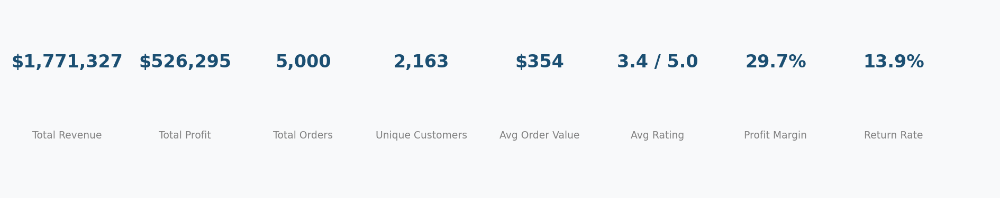
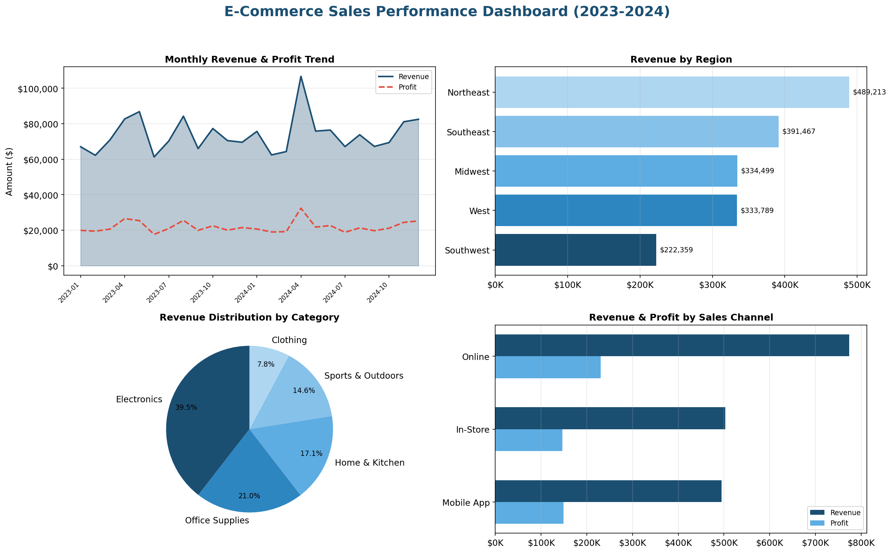
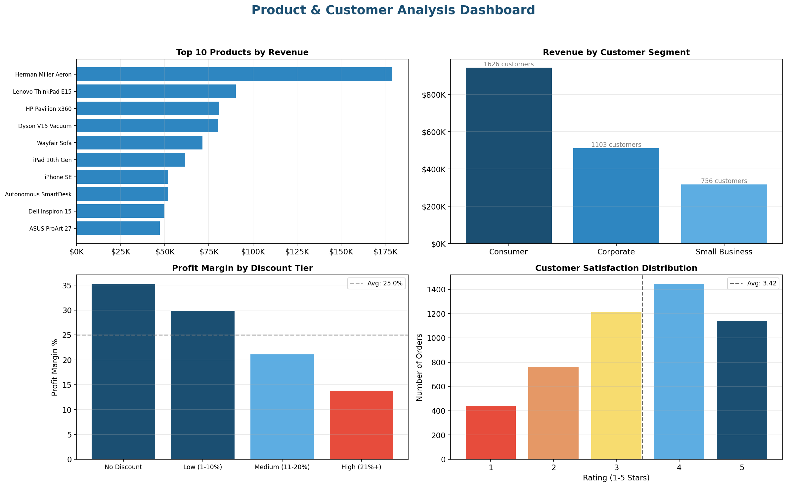

# 📊 E-Commerce Sales Performance Dashboard — SQL + Power BI

## Overview

This project analyzes **5,000 e-commerce transactions** across 2023-2024 to uncover revenue trends, product performance, customer behavior, and operational insights. I cleaned and transformed raw sales data using **SQL**, created a **star schema** data model, and built interactive **Power BI dashboards** to enable data-driven decision-making for leadership teams.



---

## Business Problem

The operations team needed a centralized dashboard to answer key business questions:

- How are sales trending month-over-month and year-over-year?
- Which regions, product categories, and customer segments drive the most revenue?
- Are discounts actually improving profitability or eroding margins?
- How does shipping speed correlate with customer satisfaction and return rates?
- Which sales channels (Online, In-Store, Mobile App) are most effective?

Previously, these answers required manual Excel reports that took **2-3 days to compile** each month. This dashboard delivers **real-time, self-service analytics**.

---

## Tools Used

| Tool | Purpose |
|------|---------|
| **SQL** (PostgreSQL) | Data cleaning, validation, transformation, KPI queries |
| **Power BI** | Interactive dashboard with slicers, drill-downs, and KPI cards |
| **Python** (Pandas, Matplotlib) | Data generation, exploratory analysis, chart prototyping |

---

## Project Structure

```
sales-dashboard-sql-powerbi/
│
├── README.md                            # Project documentation (this file)
├── ecommerce_sales_2023_2024.csv        # Raw dataset (5,000 records)
├── 01_data_cleaning.sql                 # Data validation, cleaning, star schema
├── 02_business_analysis_queries.sql     # 10 KPI queries for dashboard
├── kpi_summary.png                      # KPI summary card
├── dashboard_executive_summary.png      # Executive dashboard
└── dashboard_product_customer.png       # Product & customer analysis
```

---

## Data Model (Star Schema)

I designed a **star schema** optimized for Power BI performance:

- **Fact Table:** `fact_sales` — 5,000 transaction records with derived columns (Discount Tier, Shipping Speed, Satisfaction Level, Profit Margin %)
- **Dimension Tables:**
  - `dim_date` — Date hierarchy (Year, Quarter, Month, Day)
  - `dim_product` — Product → Sub-Category → Category hierarchy
  - `dim_customer` — Customer segment and geography

---

## SQL Highlights

### Data Cleaning (`01_data_cleaning.sql`)
- Validated NULL values across all critical columns
- Checked for duplicate Order IDs
- Verified date integrity (Ship Date > Order Date)
- Validated calculated fields (Total Sales = Unit Price × Quantity - Discount)
- Created derived columns: Discount Tier, Shipping Speed, Satisfaction Level
- Built star schema with fact and dimension tables

### Business Analysis (`02_business_analysis_queries.sql`)
10 production-ready queries covering:
1. Revenue & Profit Overview (YoY comparison)
2. Monthly Revenue Trend
3. Revenue by Region
4. Top Performing Categories & Products
5. Sales Channel Performance
6. Customer Segment Analysis
7. Discount Impact on Profitability
8. Shipping & Fulfillment Performance
9. Return Rate Root Cause Analysis
10. Year-over-Year Growth by Quarter

---

## Dashboard Screenshots

### Executive Summary


### Product & Customer Analysis


---

## Key Findings

1. **Revenue:** $1.77M total revenue with $526K profit (29.7% margin) across 5,000 orders
2. **Northeast region** leads in revenue, contributing 28% of total sales
3. **Electronics** is the highest-revenue category but **Office Supplies** has the best profit margin
4. **High discounts (21%+) significantly erode margins** — orders with no discount have ~35% margin vs ~18% for heavily discounted orders
5. **Fast shipping (1-2 days) correlates with higher customer satisfaction** (avg 3.7 rating vs 3.1 for 6+ day shipping)
6. **Online channel** generates 45% of revenue but **In-Store** has the highest average order value
7. **Consumer segment** represents 52% of orders but **Corporate** customers generate higher per-customer revenue
8. **Return rate of 13.9%** — dissatisfied customers (rating 1-2) return products at 3× the rate of satisfied customers

---

## Recommendations

Based on the analysis, I recommended the following to stakeholders:

- **Reduce high-discount promotions** — shift to targeted discounts (5-10%) which maintain margin while still driving volume
- **Invest in shipping speed** for high-value orders to improve satisfaction and reduce returns
- **Grow Corporate segment** through dedicated account management — higher CLV potential
- **Investigate Electronics returns** — highest return rate despite strong revenue contribution

---

## How to Reproduce

1. **Load Data:** Import `ecommerce_sales_2023_2024.csv` into your SQL database
2. **Run SQL Scripts:** Execute `01_data_cleaning.sql` to create production tables, then `02_business_analysis_queries.sql` for KPI outputs
3. **Connect Power BI:** Import the `fact_sales` table (or CSV export of query results) into Power BI Desktop
4. **Build Visuals:** Use the KPI queries as the foundation for your dashboard cards, charts, and slicers

---

## About Me

**Sai Pasupuleti** — Business Analyst with 3+ years of experience in requirements gathering, Power BI dashboard development, SQL data analysis, and Python automation.

📧 pradeepsai.pasupuleti@gmail.com
🔗 [LinkedIn](https://linkedin.com/in/saipasupuleti12)
